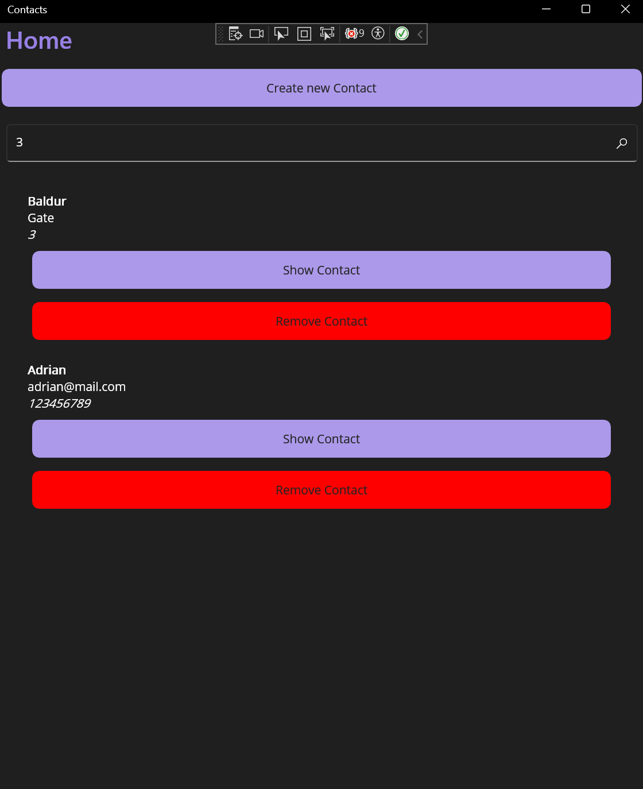

# Genesis
Code is based on "Windows Presentation Foundation Masterclass" course

[About course](https://www.udemy.com/course/windows-presentation-foundation-masterclass/)

# Technologi used
- .NET 6
- MVVM
- WPF (trying Maui)

# Example app

## Simple app to adding contact to list

